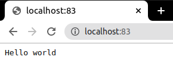

# NODEJS + PROMETHEUS + GRAPHANA => DOCKER COMPOSE
## Docker:
Es un sistema que automatiza el despliegue de aplicaciones dentro de contenedores de software, proporcionando una capa adicional de abstracción y automatización de virtualización de aplicaciones en múltiples sistemas operativos.​
## Docker Compose:
Docker Compose es una herramienta desarrollada para ayudar a definir y compartir aplicaciones de varios contenedores mediante un fichero llamado docker-compose.yml
## Proposito de esta práctica:
La finalidad de esta práctica es familiarizarse con el despliegue de diversas aplicaciones web con la herramienta docker compose para asi tener todo un ecosistema de aplicaciones con sus dependencias desplegadas independiente del sistema operativo y que esté siempre preparado y desplegable para producción

## Tecnologías utilizadas:
### NodeJS
 
Node.js es un entorno en tiempo de ejecución multiplataforma, de código abierto, para la capa del servidor basado en el lenguaje de programación JavaScript, asíncrono, con E/S de datos en una arquitectura orientada a eventos y basado en el motor V8 de Google. En esta práctica se ha utilizado un proyecto en node que tiene diversos endpoints (que devuelven texto) conectados a prometheus para así monitorizar el tráfico a este.

### Prometheus
 
Prometheus es una aplicación de software gratuita utilizada para la supervisión y alerta de eventos. Registra métricas en tiempo real en una base de datos de series de tiempo construida utilizando un modelo de extracción HTTP, con consultas flexibles y alertas en tiempo real. En la práctica se utilizará para poder tener un seguimiento de las peticiones a los distintos endpoints de la aplicación de nodejs.

### Grafana
 
Es un software que permite la visualización y el formato de datos métricos. Permite crear cuadros de mando y gráficos a partir de múltiples fuentes, incluidas bases de datos de series de tiempo como Graphite, InfluxDB y OpenTSDB.​​ Se ha utilizado esta herramienta para la monitorización gráfica de los datos extraidos por prometheus y poder representarlos de una manera gráfica.

## Proceso de desarrollo
### Aspectos generales del docker compose

Se asigna una red llamada "network_practica" a la cual estarán todos los contenedores asignados para que sean visibles entre ellos. Dos volumenes compartidos para repartir y compartir datos, el volumen del grafana y el archivo datasources.yml para la configuración del grafana.

### Desplegando NodeJS
#### Docker Compose

El contenedor de node se llamará "myapp_practica" se construirá a partir del docker file que hay en la raíz del proyecto:

La construcción del contenedor de node estará basado en una imagen node alpine 3.10 ya que estas són más ligeras. El directorio raíz será uno creado llamado "app", se copiará el contenido de la carpeta llamada "node" en el directorio raíz del contenedor creado previamente. Contenido de la carpeta node:

Se expondrá el puerto 3000 del contenedor para que este sea accesible desde fuera. Al instalarse en el nuevo contenedor, este ejecutará un "npm install" para poder traer todas las dependencias que necesitará el proyecto y así crear el node_modules con todas estas. Por último cada vez que se ejecute el contenedor se ejecutará el comando "node app.js" que pondrá el servidor node en marcha.

Continuando con el docker compose, la siguiente linea expone el puerto del host 83 al del 3000 contenedor para asi poder acceder desde nuestro puerto 83. 

Por último cabe resaltar que el contenedor estará asignado a la red network_practica para que este sea visible para los demás contenedores.

#### Demostración:

Como se puede observar, accediendo al puerto 83 de nuestra máquina host se obtiene el resultado del endpoint "/".

### Desplegando Prometheus
#### Docker Compose

El nombre del contenedor srá "prometheus_practica", basado en una imagen prometheus v2.20.1, se le asigna el puerto 9090 de nuestro host asignado al 9090 del contenedor. Con un volumen llamado "prometheus" asignado al "/etc/prometheus". Este dependerá del contenedor con node. Se ejecutará el comando --config.file=/etc/prometheus/prometheus.yml para tener la configuración de este asignada. Por último se asignará a la red en común de todos los contenedores anteriores.
#### Demostración

Como se puede apreciar en la foto, accediendo a la dirección de nuestro host y al puerto 9090 será accesible el prometheus.

### Desplegando Grafana
#### Docker compose:

Aquí estará la configuración del contenedor con grafana. Basado en una imagen grafana 7.1.5, con un nombre "grafana_practica", el puerto del contenedor 3000 enlazado al 3500 del host. Con los volumenes de myGrafanaVol asociado a /var/lib/grafana y el archivo datasources.yml de dentro del directorio de grafana asociado al del contenedor. Dependiendo del contenedor con prometheus, ya que sin este contenedor asociado no habrían datos con los que se podrian representar las gráficas. Se establecen variables de entorno las cuales definiran que: 
- Deshabilitan el login de acceso a Grafana
- Permitir la autenticación anónima
- Que el rol de autenticación anónima sea Admin-
- Que instale el plugin grafana-clock-panel 1.0.1

Por último se asocia a la red que estarán todos nuestros contenedores.
#### Demostración

#### Creación de las gráficas

Para la creación de las gráficas se tendrá que entrar a: Create > Add new panel. 
- Primera gráfica: Cuando se abra el editor de gráficas, en el apartado de query se establecerán estos datos para la creación de la primera gráfica: 

- Segunda gráfica: Una vez se haya abierto el editor de gráficas se clicará en Visualization > Stat para que se tenga una grafica de numero, y en el apartado de display y la query tendrá que quedar así: 

   

   

#### Estado final del dashboard

Como se puede observar están las dos graficas con las metricas y los datos de los distintos endpoints.

### Dockerignore
El interior de nuestro docker ignore tendrá la siguiente linea:

Para que ignore la carpeta node_modules de todas las carpetas existentes.

## Conculusión
Se ha observado como trabajar con docker compose y tener varios ecosistemas dependientes unos de otros para sacar datos en común y poder monitorizar el estado del tráfico de nuestras aplicaciones. Y todo esto grácias a una sola herramienta que nos permite el despliegue de un ecosistema de aplicaciones con solo un fichero de configuración.